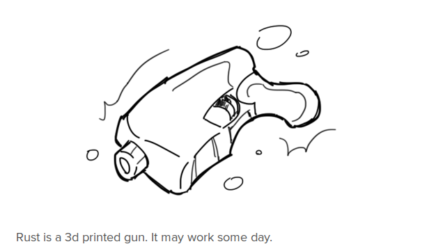

// <!--
riir_macro::print_literally! {
// -->
# RIIR
why not Rewrite It In Rust (**RIIR**)

Are you an author or contributor to a software project?

Have you ever been asked to rewrite, or consider rewriting that project in [Rust][rust-lang]?

If so, you may have been a victim of the RIIR agenda that is sweeping the web.

If this has happened to you, please [report it][issues] so that something can be done.

## FAQ

### R U SRS?

No. This is a joke.

### Y U HATE RUST SO MUCH?

I don't, actually. I believe that those who spend their time asking people to rewrite their projects are probably not themselves active Rust developers, as those active devs are probably busy [writing memory-safe code][memory-safe].

### R U OFFENDING ME?

[rust-lang]: https://www.rust-lang.org/
[issues]: https://github.com/ansuz/RIIR/issues/
[memory-safe]: https://trac.torproject.org/projects/tor/ticket/11331

<!-- }
// -->
